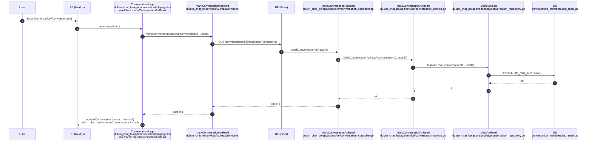
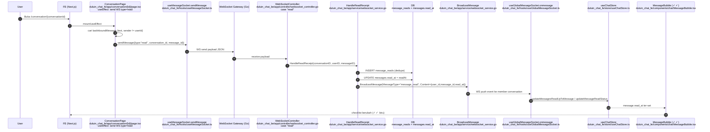

# Flow Read / Unread (duluin_chat_fe + duluin_chat_be)

Dokumen ini menjelaskan 2 mekanisme yang berbeda tetapi saling melengkapi:

- **Unread Count (badge angka di sidebar)**: berbasis `conversation_members.last_read_at` (backend) dan juga increment realtime di frontend.
- **Read Receipt (checklist/centang biru per pesan)**: berbasis event WebSocket `type:"read"` → backend broadcast `message_read` → frontend mengisi `message.read_at`.

Semua referensi file/method di bawah mengacu ke implementasi di repo:

- `duluin_chat_fe` (Next.js)
- `duluin_chat_be` (Go/Fiber)

---

## A. Unread Count: Mark Conversation as Read (REST)

### FE trigger (saat buka halaman conversation)

- File: `duluin_chat_fe/app/conversation/[id]/page.tsx`

  - Effect: "Mark conversation as read when opened"
  - Memanggil: `markConversationAsRead(conversationId, userId)`

- File: `duluin_chat_fe/services/v1/readService.ts`
  - Method: `markConversationAsRead(conversationId, userId)`
  - REST call: `POST /conversations/:id/read?user_id=...`

### BE endpoint (meng-update last_read_at)

- File: `duluin_chat_be/routes/v1/conversation.go`

  - Route: `POST /conversations/:id/read` → `ctrl.MarkConversationAsRead`

- File: `duluin_chat_be/app/controller/conversation_controller.go`

  - Method: `MarkConversationAsRead`

- File: `duluin_chat_be/app/service/conversation_service.go`

  - Method: `MarkConversationAsRead` (dipanggil oleh controller)

- File: `duluin_chat_be/app/repository/conversation_repository.go`
  - Method: `MarkAsRead`
  - Update DB: `conversation_members.last_read_at = NOW()`

### Mermaid

---

## B. Checklist / Centang Biru: Read Receipt (WebSocket)

### FE trigger (saat buka halaman conversation)

- File: `duluin_chat_fe/app/conversation/[id]/page.tsx`

  - Effect: memilih `lastInboundMessage` lalu kirim WS payload:
    - `type: "read"`
    - `conversation_id`
    - `message_id: lastInboundMessage.id`

- File: `duluin_chat_fe/hooks/useMessageSocket.ts`
  - Method: `sendMessage(payload)` → meneruskan ke global WebSocket sender

### BE handler (create read receipts + broadcast event message_read)

- File: `duluin_chat_be/app/controller/websocket_controller.go`

  - Switch: `case "read"` → `svc.HandleReadReceipt(...)`

- File: `duluin_chat_be/app/service/websocket_service.go`

  - Method: `HandleReadReceipt(conversationID, userID, messageID)`
    - Insert ke tabel `message_reads` dan update `messages.read_at`
    - Broadcast message event dengan:
      - `MessageType: "message_read"`
      - `Content` JSON `{ user_id, message_id, read_at }`
  - Method: `BroadcastMessage(conversationID, senderID, message)`

- File: `duluin_chat_be/app/model/message_read.go`
  - Model: `MessageRead` (table read receipts)

### FE receive (ubah state `message.read_at` agar checklist berubah)

- File: `duluin_chat_fe/hooks/useGlobalMessageSocket.ts`

  - Handler: jika `messageType === "message_read"`, parse JSON dan update store:
    - `useChatStore.updateMessagesReadUpToMessage(...)`
    - atau `useChatStore.updateMessageReadStatus(...)`

- File: `duluin_chat_fe/store/useChatStore.ts`

  - Method:
    - `updateMessagesReadUpToMessage(...)`
    - `updateMessageReadStatus(...)`

- File: `duluin_chat_fe/components/chat/MessageBubble.tsx`
  - Render checklist:
    - `message.read_at` ada → `CheckCheck` biru
    - tidak ada → `CheckCheck` abu-abu

### Mermaid

