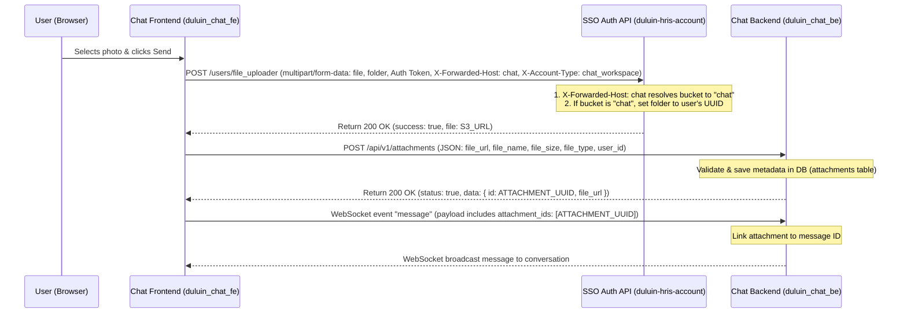

# Photo Attachment Feature Implementation Plan

Implement the photo attachment upload feature in the chat application by uploading images directly to the SSO server (`duluin-hris-account`'s `/file_uploader` endpoint) and storing the resulting S3/MinIO URLs in the chat database (`duluin_chat_be`).

## Architectural Decision

### Question: Is the upload to `users/file_uploader` done in the backend or frontend?
**Answer: Frontend.**

The upload to `NEXT_PUBLIC_AUTH_API_URL/users/file_uploader` should be performed **directly from the Frontend (`duluin_chat_fe`)**.

#### Rationale:
1. **Direct SSO Authentication**: The frontend already possesses the user's active login/SSO session token (`useAuthStore`). It has a pre-configured HTTP client (`apiAuthClient`) with interceptors to automatically attach the token.
2. **Resource Efficiency (No Double-Hop Upload)**: Directly uploading files from the browser to the SSO service prevents the Chat backend from acting as an unnecessary proxy for large binary files.
3. **SSO Context & Bucket/Folder Override**: The SSO `/file_uploader` endpoint depends on the user's login session to identify their associated tenant/company ID (`getCompanyId()`) and the active account type. Doing this on the frontend allows the SSO server to naturally obtain the session.

---

## Proposed Data & Interaction Flow



---

## User Review Required

> [!IMPORTANT]
> **SSO API Endpoint Routing Prefix:**
> In the frontend environment configuration, `NEXT_PUBLIC_AUTH_API_URL` is set to `http://localhost:8080/api`. In `duluin-hris-account`'s `routes/api.php`, the file uploader route is defined as:
> `Route::post('/file_uploader', [MinioServiceController::class, 'fileUploader']);` under the `/api` routing group (no extra `/users` prefix).
> We will ensure the frontend calls the correct configured endpoint on the gateway.

> [!WARNING]
> **CORS Configuration on SSO Server:**
> Direct-to-SSO upload requires that the SSO server (`duluin-hris-account`) allows CORS requests from the Chat Frontend origin. If CORS issues occur, we will need to confirm the CORS configurations in the SSO backend middleware.

---

## Proposed Changes

### 1. SSO Auth Server (`duluin-hris-account`)

#### [MODIFY] [MinioServiceController.php](file:///media/PersonalData/laragon/www/duluin-hris-account/app/Http/Controllers/API/MinioServiceController.php)
- Update `fileUploader` (and `fileUploaderNew`) to check the resolved bucket:
  ```php
  $file = $request->file('file');
  $bucket = $this->getBucketFromHost($request);
  $user = Auth::user();

  if ($bucket === 'chat') {
      // Organize folder based on the authenticated user's UUID (which matches duluin_chat_be user ID)
      $folder = $user ? $user->id : 'unknown_user';
      if ($request->filled('folder')) {
          $folder = $folder . '/' . str_replace(' ', '_', $request->folder);
      }
  } else {
      // Fallback folder organization for HRMS / default flows
      $company_id = $this->getCompanyId();
      $folder = $request->folder ?? '';
      $parts = explode('/', $folder);
      if (!Str::isUuid($parts[0])) {
          if ($folder === '' && $company_id) {
              $folder = "$company_id";
          } elseif ($company_id === '') {
              $folder = "$folder";
          } else {
              $folder = "$company_id/$folder";
          }
      }
      $folder = str_replace(' ', '_', $folder);
  }
  ```
- This structures the file path in MinIO/S3 as `chat/{user_uuid}/{optional_subfolder}/{filename}`.

---

### 2. Frontend Component (`duluin_chat_fe`)

#### [MODIFY] [MessageInput.tsx](file:///media/PersonalData/laragon/www/duluin_chat_fe/components/chat/MessageInput.tsx)
- Modify `handleSubmit` to call the SSO uploader:
  - Endpoint: `${NEXT_PUBLIC_AUTH_API_URL}/users/file_uploader` (or `/file_uploader`).
  - Request Headers:
    - `Authorization: Bearer <token>`
    - `X-Forwarded-Host: chat`
    - `X-Account-Type: chat_workspace`
  - Body parameters (FormData):
    - `file`: the binary image file.
    - `folder`: `"attachments"`.
- Receive the resulting S3/MinIO URL (`res.data.file`).
- Send a secondary POST request to `duluin_chat_be`'s new endpoint `/api/v1/attachments` with the attachment metadata (`file_url`, `file_name`, `file_type`, `file_size`, `user_id`) to register it in the chat database.
- Send the chat message using the registered attachment ID.

---

### 3. Chat Backend (`duluin_chat_be`)

#### [NEW] [attachment_dto.go](file:///media/PersonalData/laragon/www/duluin_chat_be/app/model/attachment_dto.go)
- Create a DTO struct for registering an attachment:
  ```go
  type RegisterAttachmentRequest struct {
      UserID   string `json:"user_id" validate:"required,uuid4"`
      FileURL  string `json:"file_url" validate:"required,url"`
      FileName string `json:"file_name" validate:"required"`
      FileType string `json:"file_type" validate:"required"`
      FileSize int    `json:"file_size" validate:"required,min=1"`
  }
  ```

#### [MODIFY] [upload_controller.go](file:///media/PersonalData/laragon/www/duluin_chat_be/app/controller/upload_controller.go)
- Add a new controller method `RegisterAttachment(c *fiber.Ctx) error`:
  - Parse request body into `RegisterAttachmentRequest` DTO.
  - Validate parameters.
  - Instantiate `model.Attachment`.
  - Save to database via `ctrl.svc.CreateAttachment`.
  - Return the created attachment data using `utils.Ok(...)` standard response helper.

#### [MODIFY] [upload.go](file:///media/PersonalData/laragon/www/duluin_chat_be/routes/v1/upload.go)
- Register the metadata route:
  `route.Post("/attachments", ctrl.RegisterAttachment)`

---

## Verification Plan

### Manual Verification
1. **SSO Upload Path Validation**: Trigger an upload. Verify in the Network tab that the request carries `X-Forwarded-Host: chat` and the response URL matches the pattern `.../chat/{user_uuid}/attachments/{filename}`.
2. **Metadata Registration**: Verify that the frontend registers the metadata correctly via `POST /api/v1/attachments` on `duluin_chat_be`, returning the attachment UUID.
3. **Chat Broadcast**: Send the message and verify the image is rendered correctly in the conversation history/bubble.
